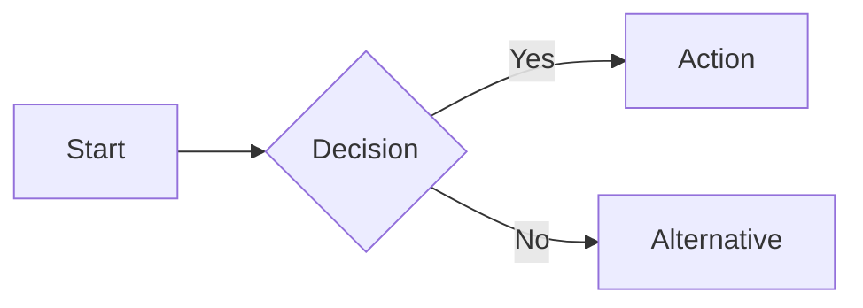

# GEMINI.md — Gemini CLI Agent Instructions

This file provides guidance to **Gemini CLI** when working in this repository. It is the Gemini-native equivalent of `CLAUDE.md` and `.github/copilot-instructions.md`.

---

## Project Overview

This repository is **"GitHub Copilot in a Weekend"** — a structured tutorial course that teaches GitHub Copilot features through 10 progressive modules. It was originally a Claude Code tutorial (`CLAUDE.md` still exists for reference) and has been extended to cover GitHub Copilot equivalents.

**What this repo contains:**
- Original Claude How To modules (`01-slash-commands/` through `10-cli/`) — do not modify
- New Copilot course modules in `copilot-course/` (01–10)
- A `TRANSITION_GUIDE.md` mapping Claude → Copilot concepts
- A `self-assessment.sh` interactive quiz
- Build scripts in `scripts/` (Python) for EPUB generation and quality checks

---

## Directory Structure

```
├── copilot-course/               ← New Copilot course (primary content)
│   ├── README.md                 ← Course landing page
│   ├── 01-chat-commands/
│   ├── 02-custom-instructions/
│   ├── 03-extensions/
│   ├── 04-agent-mode/
│   ├── 05-mcp/
│   ├── 06-actions-integration/
│   ├── 07-workspace/
│   ├── 08-version-control/
│   ├── 09-advanced-features/
│   └── 10-cli/
├── 01-slash-commands/            ← Original Claude modules (read-only)
│   …
├── 10-cli/
├── scripts/                      ← Python build/validation utilities
├── CLAUDE.md                     ← Claude Code instructions
├── GEMINI.md                     ← This file (Gemini CLI instructions)
├── TRANSITION_GUIDE.md           ← Claude → Copilot concept mapping
├── self-assessment.sh            ← Interactive bash quiz
└── README.md                     ← Repo root README
```

---

## How Gemini CLI Works

Gemini CLI (`gemini`) is Google's command-line AI coding assistant powered by the Gemini model family. Key differences from Claude Code and GitHub Copilot:

| Aspect | Gemini CLI | Claude Code | GitHub Copilot |
|--------|-----------|-------------|----------------|
| **Config file** | `GEMINI.md` | `CLAUDE.md` | `.github/copilot-instructions.md` |
| **Invocation** | `gemini -p "query"` | `claude "query"` | VS Code / `gh copilot` |
| **Interactive mode** | `gemini chat` | `claude` | VS Code Chat panel |
| **Model** | Gemini 2.0 / 2.5 Pro | Claude 3.x | Multi-model picker |
| **MCP support** | Via `gemini mcp` | Via settings.json | Via `.vscode/mcp.json` |
| **Context file** | `GEMINI.md` (auto-loaded) | `CLAUDE.md` (auto-loaded) | `.github/copilot-instructions.md` |

---

## Gemini CLI Quick Reference

### Installation

```bash
# Install Gemini CLI
npm install -g @google/gemini-cli

# Authenticate
gemini auth login

# Verify
gemini --version
```

### Basic Usage

```bash
# One-shot query
gemini -p "Explain the MCP configuration in .vscode/mcp.json"

# Interactive chat session
gemini chat

# Reference a file in your query
gemini -p "Review this file" --file copilot-course/01-chat-commands/README.md

# Use a specific model
gemini -p "Generate a GitHub Actions workflow" --model gemini-2.5-pro

# Pipe content
cat copilot-course/05-mcp/README.md | gemini -p "Summarise this module"
```

### MCP Integration

```bash
# List available MCP servers
gemini mcp list

# Connect a filesystem MCP server
gemini mcp add filesystem --command "npx -y @modelcontextprotocol/server-filesystem ."

# Start a session with MCP context
gemini chat --mcp filesystem
```

### Common Workflows for This Repository

```bash
# Generate a new module README
gemini -p "Create a README for a new Copilot module about security features, following the pattern in copilot-course/01-chat-commands/README.md" --file copilot-course/01-chat-commands/README.md

# Check Mermaid syntax
gemini -p "Validate all Mermaid diagrams in this file and report any syntax errors" --file copilot-course/04-agent-mode/README.md

# Suggest improvements
gemini -p "Improve the examples in this module to be more practical and include error cases" --file copilot-course/03-extensions/README.md

# Generate quiz questions
gemini -p "Generate 5 multiple-choice questions about the content in this module" --file copilot-course/09-advanced-features/README.md
```

---

## Content Guidelines

When generating or editing content for this repository:

1. **Never modify** original Claude modules (`01-slash-commands/` through `10-cli/`)
2. **Follow module structure**: H1 title → H2 sections → H3 subsections
3. **Every module must have** at least one valid Mermaid diagram
4. **All code blocks must** specify a language tag (` ```bash `, ` ```json `, etc.)
5. **Include comparison tables** when mapping Claude → Copilot concepts
6. **Use realistic examples** — copy-paste ready, not placeholder pseudocode
7. **Link between modules** using relative paths

### Mermaid Diagram Requirements

```markdown

```

All diagrams must be one of: `flowchart`, `sequenceDiagram`, `graph`, `classDiagram`, `stateDiagram-v2`, `erDiagram`, `gantt`, or `pie`.

---

## Mapping from CLAUDE.md Concepts

If you are familiar with how `CLAUDE.md` works in Claude Code, here is how the same patterns apply to Gemini CLI:

| CLAUDE.md Pattern | GEMINI.md Equivalent |
|-------------------|----------------------|
| `## Common Commands` section | `## Gemini CLI Quick Reference` section |
| Project overview at top | Project overview at top |
| Directory tree | Directory tree (same format) |
| Style/convention rules | Content guidelines |
| Auto-loaded on session start | Auto-loaded when `gemini chat` starts in this directory |
| Markdown format | Markdown format |

---

## Running Quality Checks

```bash
# Install Python dependencies
pip install uv
uv venv && source .venv/bin/activate
uv pip install -r scripts/requirements-dev.txt

# Run all pre-commit checks
pre-commit run --all-files

# Run Python tests
pytest scripts/tests/ -v

# Build EPUB (requires internet for Mermaid rendering)
uv run scripts/build_epub.py
```

---

## Gemini vs Claude vs Copilot — When to Use Each

| Task | Recommended Tool |
|------|-----------------|
| Writing long-form documentation | Gemini CLI (large context window) |
| Autonomous multi-file code edits | GitHub Copilot Agent Mode |
| Terminal command suggestions | `gh copilot suggest` |
| Explaining complex code | Any (Gemini excels at multimodal) |
| Generating GitHub Actions | GitHub Copilot (repo context via @workspace) |
| Image/diagram analysis | Gemini CLI (native vision) |
| Quick one-liners | `gemini -p "..."` or `gh copilot suggest` |
| Interactive coding session | `claude` or `gemini chat` |

---

*This file is automatically read by Gemini CLI when you run `gemini chat` in this repository. Keep it updated as the repository evolves.*
