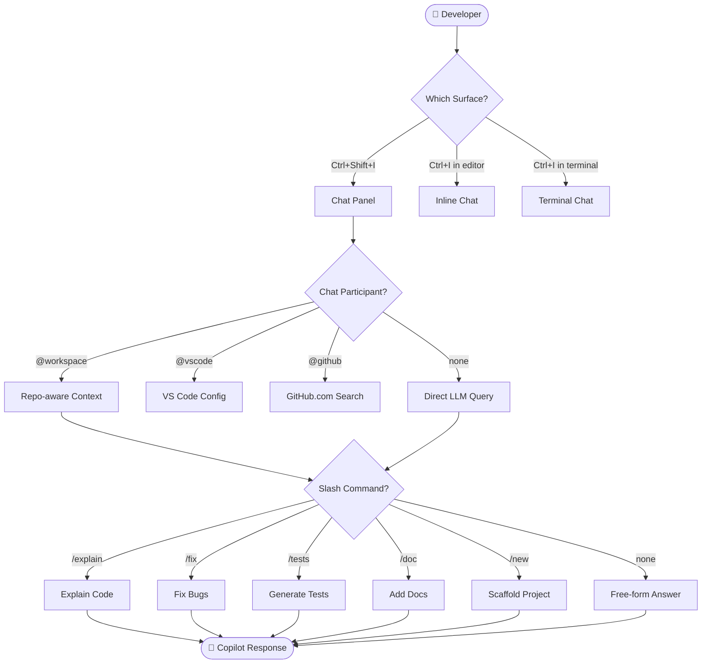

# GitHub Copilot Chat Commands

GitHub Copilot Chat provides a rich set of built-in slash commands, chat participants, and prompt patterns that make AI assistance fast and predictable. This module covers every built-in command and shows you how to craft prompts that get great results.

---

## Table of Contents

- [Built-in Slash Commands](#built-in-slash-commands)
- [Chat Surfaces](#chat-surfaces)
- [Chat Participants](#chat-participants)
- [Command Flow Diagram](#command-flow-diagram)
- [Prompt Crafting Best Practices](#prompt-crafting-best-practices)
- [Copy-Paste Prompt Examples](#copy-paste-prompt-examples)
- [Comparison with Claude Slash Commands](#comparison-with-claude-slash-commands)

---

## Built-in Slash Commands

Slash commands are shortcuts that tell Copilot exactly what kind of help you need.

| Command | Purpose | Best Used When |
|---------|---------|----------------|
| `/explain` | Explain selected code in plain English | Onboarding to a new codebase |
| `/fix` | Identify and fix bugs in selected code | Debugging compilation errors or logic bugs |
| `/tests` | Generate unit tests for selected code | After writing a function |
| `/doc` | Add documentation comments | Before code review or open-sourcing |
| `/new` | Scaffold a new project or file | Starting a feature from scratch |
| `/newNotebook` | Create a new Jupyter notebook | Data exploration or ML tasks |
| `/clear` | Clear the chat history | Starting a new unrelated task |
| `/help` | Show available commands and tips | When you're not sure what's possible |

### Using Commands

```
# In VS Code Chat panel (Ctrl+Shift+I / Cmd+Shift+I)
/explain What does the reduce function do here?

# With selected code context
[Select 20 lines of code] → Ctrl+I → /fix the off-by-one error

# Scaffold a new project
/new create a React TypeScript app with Tailwind CSS and React Router

# Generate tests for selected function
[Select function] → /tests using Jest and React Testing Library
```

---

## Chat Surfaces

GitHub Copilot Chat is available in three surfaces within VS Code:

### 1. Chat Panel (Sidebar)

Open with `Ctrl+Shift+I` (Windows/Linux) or `Cmd+Shift+I` (macOS). Best for:
- Multi-turn conversations
- Questions about the whole codebase
- Generating larger pieces of code

### 2. Inline Chat (`Ctrl+I`)

Appears directly in the editor at your cursor. Best for:
- Quick fixes to a specific line or selection
- Generating code to replace a `// TODO:` comment
- Immediate transformations

```
# Example inline chat workflow
1. Select a function
2. Press Ctrl+I
3. Type: "refactor to use async/await instead of callbacks"
4. Press Enter → Accept with Tab, reject with Esc
```

### 3. Terminal Chat (`Ctrl+I` in Terminal)

Available inside the VS Code integrated terminal. Best for:
- Shell command suggestions
- Explaining command output
- Generating scripts

```bash
# Open VS Code terminal, press Ctrl+I, then type:
how do I recursively find all .log files modified in the last 7 days and delete them?
```

---

## Chat Participants

Chat participants route your query to a specialised agent with domain knowledge:

| Participant | Scope | Example Query |
|-------------|-------|---------------|
| `@workspace` | Your full repo | `@workspace explain the authentication flow` |
| `@vscode` | VS Code settings and features | `@vscode how do I configure ESLint` |
| `@terminal` | Shell and terminal | `@terminal explain the last command output` |
| `@github` | GitHub.com issues, PRs, docs | `@github find open issues about login bugs` |

```
# Combine participant with command
@workspace /explain the database connection pooling logic

# Ask about VS Code configuration
@vscode how do I set up a launch.json for debugging Node.js

# Search GitHub issues from chat
@github list open PRs with failing tests
```

---

## Command Flow Diagram



---

## Prompt Crafting Best Practices

### Be Specific About Context

```
# ❌ Vague
/fix the bug

# ✅ Specific
/fix the NullPointerException that occurs when user.profile is undefined on line 42
```

### Specify the Output Format

```
# ✅ Request structured output
/explain this function and format your answer as:
1. What it does
2. Parameters
3. Return value
4. Edge cases
```

### Anchor to Your Tech Stack

```
# ✅ Stack-aware prompt
@workspace /tests generate unit tests for the UserService class using Jest, mock the database with jest.mock(), and cover the happy path plus three error cases
```

### Iterate with Follow-ups

```
Turn 1: /explain the event loop in Node.js
Turn 2: now show me a practical example with setTimeout and Promise
Turn 3: what happens when the event loop is blocked?
```

---

## Copy-Paste Prompt Examples

### Explain Complex Code

```
/explain this function step by step, including what each variable represents and why the algorithm works
```

### Generate Tests

```
/tests
- Use Jest and Testing Library
- Cover: happy path, empty input, invalid input, network error
- Use descriptive test names following "should [behaviour] when [condition]"
- Mock external dependencies
```

### Document a Module

```
/doc add JSDoc comments to all exported functions in this file. Include:
- @param with types and descriptions
- @returns with type and description
- @throws for any exceptions
- @example with a realistic usage snippet
```

### Scaffold a REST API

```
/new create a Node.js Express REST API for a todo app with:
- TypeScript
- Routes: GET /todos, POST /todos, PUT /todos/:id, DELETE /todos/:id
- In-memory storage (no database)
- Input validation with zod
- Error handling middleware
```

### Refactor for Readability

```
Refactor this function to:
1. Use early returns instead of nested if/else
2. Extract magic numbers as named constants
3. Add a brief comment above each logical section
Keep the same behaviour.
```

---

## Comparison with Claude Slash Commands

| Claude Command | Copilot Equivalent | Notes |
|----------------|-------------------|-------|
| `/help` | `/help` | Same purpose |
| `/clear` | `/clear` | Same purpose |
| `/compact` | N/A — context managed automatically | Copilot manages context window internally |
| `/model <name>` | Model picker dropdown in Chat UI | GUI-based in Copilot |
| `/add-dir <path>` | `@workspace` participant | Copilot auto-indexes the workspace |
| Custom slash commands | Custom instructions + prompt templates | No user-defined commands; use instructions instead |
| `/init` | `copilot-setup-steps.yml` | Environment setup moved to CI/CD |
| `/review` | Built into PR reviews on GitHub.com | Available natively on GitHub |

> **Key difference:** Claude allows users to define custom slash commands as markdown templates. Copilot does not — customisation is done through `.github/copilot-instructions.md` and reusable prompt snippets instead.

---

## Next Module

[02 — Custom Instructions →](../02-custom-instructions/README.md)
