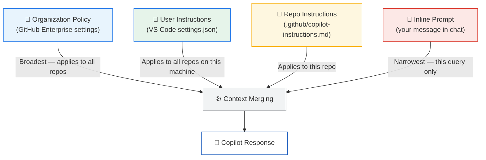

# Custom Instructions & Copilot Instructions Files

Custom instructions let you give GitHub Copilot persistent context about your project, team conventions, and coding standards — without repeating yourself in every prompt. This is the Copilot equivalent of `CLAUDE.md`.

---

## Table of Contents

- [Instruction Hierarchy](#instruction-hierarchy)
- [Repo-Level: .github/copilot-instructions.md](#repo-level-githubcopilot-instructionsmd)
- [User-Level: VS Code Settings](#user-level-vs-code-settings)
- [Organization-Level Instructions](#organization-level-instructions)
- [Writing Effective Instructions](#writing-effective-instructions)
- [Hierarchy Diagram](#hierarchy-diagram)
- [Templates for Different Project Types](#templates-for-different-project-types)
- [Migrating from CLAUDE.md](#migrating-from-claudemd)

---

## Instruction Hierarchy

Copilot applies instructions in a layered model. More specific layers override broader ones:

```
Organization Policy (broadest)
    └── User-Level Instructions (VS Code settings)
            └── Repository-Level Instructions (.github/copilot-instructions.md)
                    └── Inline Prompt Context (narrowest)
```

All layers are **additive** — they stack rather than replace each other, unless a lower layer explicitly contradicts a higher one.

---

## Repo-Level: .github/copilot-instructions.md

This file is automatically loaded whenever `@workspace` is used in Copilot Chat, or when the Copilot coding agent runs on your repository.

### Location

```
your-repo/
└── .github/
    └── copilot-instructions.md   ← Create this file
```

### Minimal Example

```markdown
# Project: My Awesome API

## Language & Runtime
- TypeScript 5.x, Node.js 20 LTS
- Use ES modules (import/export), never CommonJS require()

## Code Style
- 2-space indentation
- Single quotes for strings
- Trailing commas in multi-line arrays and objects
- Use `const` by default; `let` only when reassignment is needed

## Testing
- Jest for unit tests
- Supertest for integration tests
- File naming: `*.test.ts`
- Aim for 80% coverage on business logic

## Do Not
- Do not add console.log statements in production code
- Do not use `any` type in TypeScript
- Do not commit secrets or API keys
```

---

## User-Level: VS Code Settings

User-level instructions apply across all repositories on your machine. Set them in VS Code:

1. Open **Settings** (`Ctrl+,` / `Cmd+,`)
2. Search for `Copilot Custom Instructions`
3. Click **Edit in settings.json**
4. Add your instructions:

```json
{
  "github.copilot.chat.codeGeneration.instructions": [
    {
      "text": "Always add error handling with try/catch. Prefer descriptive variable names. Add a JSDoc comment to every exported function."
    }
  ],
  "github.copilot.chat.testGeneration.instructions": [
    {
      "text": "Use descriptive test names: 'should [expected behaviour] when [condition]'. Always include at least one sad-path test."
    }
  ]
}
```

You can also reference a file:

```json
{
  "github.copilot.chat.codeGeneration.instructions": [
    {
      "file": "~/.config/copilot/my-instructions.md"
    }
  ]
}
```

---

## Organization-Level Instructions

GitHub Enterprise organizations can set Copilot policies and instructions at the org level via **GitHub Organization Settings → Copilot → Policies**. These override or augment repo-level instructions for all members.

Use cases:
- Enforce security policies (no hardcoded credentials)
- Standardise on internal libraries
- Require specific license headers

---

## Writing Effective Instructions

### Structure

Good instructions follow this pattern:

1. **Identity** — What is this project?
2. **Tech stack** — Languages, frameworks, versions
3. **Conventions** — Style, naming, structure
4. **Constraints** — What Copilot should never do
5. **Special rules** — Anything project-specific

### Dos and Don'ts

| ✅ Do | ❌ Don't |
|-------|---------|
| Be specific: "Use 2-space indent" | Be vague: "Follow best practices" |
| Use imperative mood: "Always add error handling" | Use passive: "Error handling is preferred" |
| List the exact libraries: "Use Zod for validation" | List categories: "Use a validation library" |
| Keep it under 500 words | Write a novel |
| Update when conventions change | Let instructions go stale |

---

## Hierarchy Diagram



---

## Templates for Different Project Types

### Node.js / TypeScript API

```markdown
# Project Instructions

## Stack
- TypeScript 5.x, Node.js 20, Express 5
- Prisma ORM, PostgreSQL
- Jest + Supertest for tests

## Conventions
- All handlers are async; use try/catch with a central error middleware
- Return { data, error } objects — never throw from controller layer
- Database calls go in service layer, never directly in routes
- Use Zod schemas for all request body validation

## Naming
- Files: kebab-case.ts
- Classes: PascalCase
- Functions/variables: camelCase
- Constants: SCREAMING_SNAKE_CASE
- Database tables: snake_case

## Testing
- Unit test every service function
- Integration test every route
- Name tests: "should [verb] [noun] when [condition]"
```

### Python Data Science

```markdown
# Project Instructions

## Stack
- Python 3.11, pandas 2.x, scikit-learn, matplotlib/seaborn
- Jupyter notebooks for exploration, .py modules for production code
- pytest for unit tests

## Conventions
- Type-annotate all functions
- Use descriptive variable names (no single letters except loop counters)
- DataFrames named with `_df` suffix: `users_df`, `features_df`
- Random seeds: always set seed=42 for reproducibility

## Data Handling
- Never modify raw data; create processed copies
- Validate input DataFrames at function entry with shape/dtype checks
- Log dataset sizes before and after transformations

## Do Not
- Do not use inplace=True on DataFrames
- Do not ignore deprecation warnings
```

### React Frontend

```markdown
# Project Instructions

## Stack
- React 18, TypeScript, Vite
- React Query for data fetching
- Tailwind CSS for styling
- Vitest + React Testing Library for tests

## Conventions
- Functional components only — no class components
- Custom hooks prefixed with `use`: useUserProfile, useCart
- One component per file
- Props interface named `[ComponentName]Props`

## Styling
- Tailwind utility classes in className — no inline styles
- Responsive: mobile-first (sm: md: lg: breakpoints)
- Use design tokens from tailwind.config.ts

## Accessibility
- All interactive elements have aria-label or accessible text
- Images have meaningful alt text
- Form inputs always have associated labels
```

---

## Migrating from CLAUDE.md

The migration from `CLAUDE.md` to `.github/copilot-instructions.md` is straightforward — both are markdown files with similar purposes.

### Step-by-Step Migration

```bash
# 1. Create the target directory if needed
mkdir -p .github

# 2. Copy the file
cp CLAUDE.md .github/copilot-instructions.md

# 3. Edit the copy — remove Claude-specific sections
#    (e.g., /slash-command definitions, hook configs)
#    Keep: project overview, tech stack, conventions, constraints
```

### What to Keep vs Remove

| CLAUDE.md Content | Keep in copilot-instructions.md? |
|-------------------|----------------------------------|
| Project overview | ✅ Yes |
| Tech stack / versions | ✅ Yes |
| Coding conventions | ✅ Yes |
| "Do not" rules | ✅ Yes |
| `/slash-command` definitions | ❌ No (Copilot doesn't use custom commands) |
| Hook configurations | ❌ No (move to GitHub Actions) |
| MCP server configs | ❌ No (move to `.vscode/mcp.json`) |
| `## Common Commands` section | ⚠️ Optional (useful for agent context) |

---

## Next Module

[03 — GitHub Copilot Extensions →](../03-extensions/README.md)
