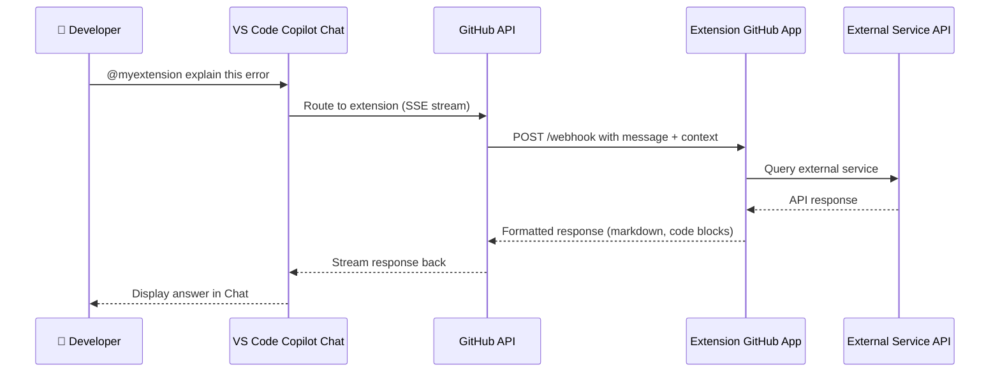

# GitHub Copilot Extensions

GitHub Copilot Extensions let you bring external tools, data sources, and services directly into Copilot Chat using the `@extension-name` syntax. They are the Copilot equivalent of Claude Skills — reusable capabilities that extend the base AI with domain-specific knowledge.

---

## Table of Contents

- [What Are Copilot Extensions?](#what-are-copilot-extensions)
- [Finding and Installing Extensions](#finding-and-installing-extensions)
- [Using Extensions in Chat](#using-extensions-in-chat)
- [Popular Extensions](#popular-extensions)
- [Extension Architecture Diagram](#extension-architecture-diagram)
- [Extension Types: Skillsets vs Agents](#extension-types-skillsets-vs-agents)
- [Building Your Own Extension](#building-your-own-extension)
- [Mapping from Claude Skills](#mapping-from-claude-skills)

---

## What Are Copilot Extensions?

A Copilot Extension is a **GitHub App** that registers itself as a Copilot Chat participant. When a user mentions `@extension-name` in chat, GitHub routes the message to that app's webhook, which can:

- Query external APIs (e.g., fetch Docker Hub image metadata)
- Access proprietary data (e.g., internal documentation)
- Execute actions (e.g., create a Sentry issue)
- Return formatted responses with code blocks and links

Extensions appear exactly like built-in participants (`@workspace`, `@vscode`) but are provided by third parties or your own organisation.

---

## Finding and Installing Extensions

### Marketplace Discovery

1. Open **GitHub Marketplace** → [github.com/marketplace?type=apps&copilot_app=true](https://github.com/marketplace?type=apps&copilot_app=true)
2. Browse extensions by category (DevOps, Security, Databases, etc.)
3. Click **Install** → choose your account or organisation
4. Authorize the GitHub App permissions

### VS Code Marketplace

Some extensions are also distributed as VS Code extensions:

```bash
# Install from VS Code CLI
code --install-extension <publisher>.<extension-name>
```

### Verifying Installation

After installation, the extension should appear when you type `@` in Copilot Chat:

```
@         ← typing @ shows available participants
@docker   ← Docker extension
@azure    ← Azure extension
@workspace← built-in
```

---

## Using Extensions in Chat

### Basic Invocation

```
@extension-name [optional slash command] [your query]
```

### Examples

```
# Ask the Docker extension about your Dockerfile
@docker explain why this Dockerfile layer is large

# Use Sentry to look up recent errors
@sentry show the top 5 errors from the last 24 hours

# Azure DevOps integration
@azure list my open work items

# DataBricks for data pipeline help
@databricks explain how to optimise this Spark job
```

### Combining with Built-in Commands

Some extensions support their own slash commands:

```
@docker /scout analyse this image for CVEs
@stripe /docs show me the Checkout Session API
```

---

## Popular Extensions

| Extension | Publisher | Use Case | Invocation |
|-----------|-----------|----------|------------|
| Docker | Docker Inc. | Container analysis, Docker Scout security | `@docker` |
| Databricks | Databricks | Spark jobs, notebooks, ML pipelines | `@databricks` |
| Sentry | Sentry | Error monitoring and debugging | `@sentry` |
| Azure | Microsoft | Azure resource management | `@azure` |
| Stripe | Stripe | Payment API documentation | `@stripe` |
| LaunchDarkly | LaunchDarkly | Feature flag management | `@launchdarkly` |
| Datadog | Datadog | Monitoring, APM, logs | `@datadog` |
| New Relic | New Relic | Observability insights | `@newrelic` |

---

## Extension Architecture Diagram



---

## Extension Types: Skillsets vs Agents

GitHub Copilot supports two extension implementation patterns:

### Skillset Extensions (Simpler)

Skillsets define a set of named functions that Copilot can call. You implement each function as an HTTP endpoint. Copilot decides *when* to call each function based on the conversation.

```
Skillset = collection of functions
           ↓
           Copilot picks the right function
           ↓
           Your server executes it
           ↓
           Returns structured data
```

**Ideal for:** Fetching data from external APIs (like the Claude Skills model).

### Agent Extensions (Full Control)

Agent extensions receive the full conversation and generate the response themselves. They implement the Copilot Extension webhook protocol and stream responses back.

```
Agent = full conversational logic
        ↓
        Receives: messages array + context
        ↓
        Optionally calls external APIs
        ↓
        Streams: markdown response
```

**Ideal for:** Complex, multi-step workflows with full reasoning control.

### Comparison Table

| Aspect | Skillset | Agent |
|--------|----------|-------|
| Complexity | Low | High |
| Copilot controls reasoning | Yes | No |
| Custom response formatting | Limited | Full control |
| Closest Claude equivalent | Skill markdown file | Full subagent |
| Implementation | HTTP functions | Streaming webhook |

---

## Building Your Own Extension

### Prerequisites

- A publicly accessible server (or ngrok tunnel for local dev)
- A GitHub App registration
- Basic knowledge of HTTP webhooks

### Step 1: Create a GitHub App

```bash
# Go to: github.com/settings/apps/new
# Required settings:
#   - Webhook URL: https://your-server.com/copilot-extension
#   - Permissions: Copilot Chat → Read
#   - Callback URL: https://your-server.com/callback
```

### Step 2: Implement the Webhook (Node.js example)

```javascript
import express from 'express';
import { verifyAndParseRequest, createAckEvent, createTextEvent, createDoneEvent } from '@copilot-extensions/preview-sdk';

const app = express();
app.use(express.json());

app.post('/copilot-extension', async (req, res) => {
  // Verify the request is from GitHub
  const { messages } = await verifyAndParseRequest(req, process.env.GITHUB_WEBHOOK_SECRET);

  // Stream the response
  res.setHeader('Content-Type', 'text/event-stream');

  // Acknowledge receipt
  res.write(createAckEvent());

  // Get the user's last message
  const userMessage = messages.at(-1)?.content ?? '';

  // Your logic here
  const answer = await callYourExternalAPI(userMessage);

  // Stream the answer
  res.write(createTextEvent(answer));
  res.write(createDoneEvent());
  res.end();
});

app.listen(3000);
```

### Step 3: Define Skills (for Skillset type)

```json
{
  "skills": [
    {
      "id": "get_error_details",
      "description": "Fetches details about a specific error ID from our error tracking system",
      "parameters": {
        "type": "object",
        "properties": {
          "error_id": {
            "type": "string",
            "description": "The unique error identifier"
          }
        },
        "required": ["error_id"]
      }
    }
  ]
}
```

### Step 4: Test Locally

```bash
# Start ngrok tunnel
ngrok http 3000

# Update your GitHub App webhook URL to the ngrok URL
# Then test in VS Code:
# @your-extension hello, this is a test
```

---

## Mapping from Claude Skills

Claude Skills are simple markdown files in `~/.claude/skills/`. Copilot Extensions are more powerful but more complex.

| Claude Skills | Copilot Extensions |
|---------------|--------------------|
| Markdown file with instructions | GitHub App with webhook |
| Stored in `~/.claude/skills/` | Installed from marketplace |
| Invoked by name in prompt | Invoked as `@extension-name` |
| Template-based | Full programmatic logic |
| No external API calls | Can call any external API |
| Single-user | Multi-tenant, multi-org |
| No auth needed | GitHub App OAuth |
| Created in minutes | Takes hours to build and deploy |

**Migration path:** If you have a Claude Skill that fetches data from an API, turn it into a Copilot Extension skillset. If it's purely a prompt template with no external calls, encode it in `.github/copilot-instructions.md` as a section of instructions.

---

## Next Module

[04 — Copilot Agent Mode & Coding Agent →](../04-agent-mode/README.md)
