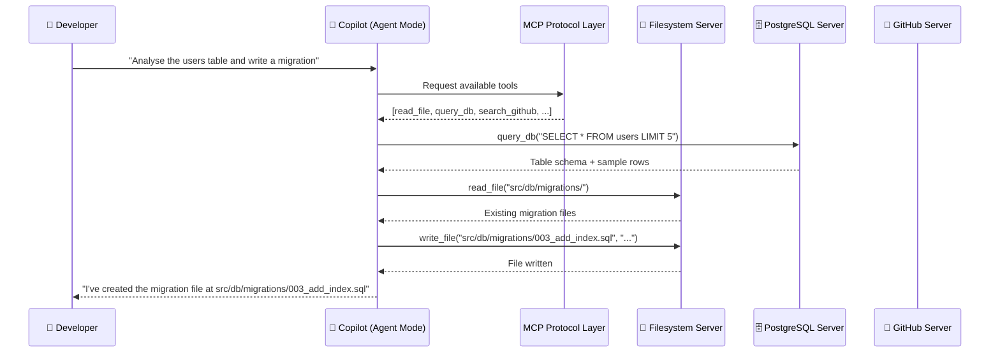

# Model Context Protocol (MCP) with GitHub Copilot

The Model Context Protocol (MCP) is an open standard that lets AI models interact with external tools and data sources in a structured way. Both Claude Code and GitHub Copilot implement MCP — this module focuses on how to configure and use MCP servers with Copilot.

---

## Table of Contents

- [What is MCP?](#what-is-mcp)
- [Configuring MCP in VS Code](#configuring-mcp-in-vs-code)
- [MCP Configuration File: .vscode/mcp.json](#mcp-configuration-file-vscodemcpjson)
- [Available MCP Servers](#available-mcp-servers)
- [Authentication and Security](#authentication-and-security)
- [MCP Architecture Diagram](#mcp-architecture-diagram)
- [Common Use Case Configurations](#common-use-case-configurations)
- [Mapping from Claude MCP](#mapping-from-claude-mcp)

---

## What is MCP?

MCP defines a standard protocol for an AI model (the "client") to communicate with external services (the "servers"). An MCP server exposes:

- **Resources** — Data the model can read (files, database rows, API responses)
- **Tools** — Actions the model can take (run a query, call an API, execute code)
- **Prompts** — Pre-defined prompt templates the model can use

When an MCP server is connected, Copilot can use it in agent mode — automatically calling the right tool at the right time.

---

## Configuring MCP in VS Code

MCP servers can be configured in two places:

### Option 1: Workspace Config (`.vscode/mcp.json`)

Checked into version control — shared with the whole team.

```
your-repo/
└── .vscode/
    └── mcp.json    ← Create this file
```

### Option 2: VS Code User Settings (`settings.json`)

Personal configuration — not shared with the team.

```json
// settings.json (Ctrl+Shift+P → "Open User Settings (JSON)")
{
  "mcp": {
    "servers": {
      "github": {
        "type": "http",
        "url": "https://api.githubcopilot.com/mcp/"
      }
    }
  }
}
```

---

## MCP Configuration File: .vscode/mcp.json

### File Schema

```json
{
  "servers": {
    "<server-name>": {
      "type": "stdio" | "http",
      // for stdio:
      "command": "<executable>",
      "args": ["<arg1>", "<arg2>"],
      "env": { "<KEY>": "<value>" },
      // for http:
      "url": "<server-url>",
      "headers": { "<Header>": "<value>" }
    }
  }
}
```

### Complete Example

```json
{
  "servers": {
    "github": {
      "type": "http",
      "url": "https://api.githubcopilot.com/mcp/",
      "gallery": true
    },
    "filesystem": {
      "type": "stdio",
      "command": "npx",
      "args": [
        "-y",
        "@modelcontextprotocol/server-filesystem",
        "${workspaceFolder}"
      ]
    },
    "postgres": {
      "type": "stdio",
      "command": "npx",
      "args": ["-y", "@modelcontextprotocol/server-postgres"],
      "env": {
        "POSTGRES_CONNECTION_STRING": "${env:DATABASE_URL}"
      }
    },
    "fetch": {
      "type": "stdio",
      "command": "uvx",
      "args": ["mcp-server-fetch"]
    }
  }
}
```

> **Security note:** Never hardcode credentials. Use `${env:VARIABLE_NAME}` to reference environment variables.

---

## Available MCP Servers

### Official Servers (from Anthropic / MCP Community)

| Server | Package | Description |
|--------|---------|-------------|
| **Filesystem** | `@modelcontextprotocol/server-filesystem` | Read/write local files |
| **GitHub** | `@modelcontextprotocol/server-github` | GitHub API access |
| **PostgreSQL** | `@modelcontextprotocol/server-postgres` | Query PostgreSQL databases |
| **SQLite** | `@modelcontextprotocol/server-sqlite` | Query SQLite files |
| **Fetch** | `mcp-server-fetch` | Make HTTP requests |
| **Brave Search** | `@modelcontextprotocol/server-brave-search` | Web search via Brave |
| **Memory** | `@modelcontextprotocol/server-memory` | Persistent key-value store |
| **Puppeteer** | `@modelcontextprotocol/server-puppeteer` | Browser automation |

### GitHub's Native MCP Server

GitHub provides a first-party MCP server that gives Copilot access to GitHub APIs:

```json
{
  "servers": {
    "github": {
      "type": "http",
      "url": "https://api.githubcopilot.com/mcp/",
      "gallery": true
    }
  }
}
```

This server provides tools for:
- Searching code across GitHub
- Reading issue and PR content
- Accessing repository metadata
- Querying GitHub Actions runs

---

## Authentication and Security

### Environment Variables (Recommended)

```json
{
  "servers": {
    "my-api": {
      "type": "stdio",
      "command": "node",
      "args": ["./mcp-server.js"],
      "env": {
        "API_KEY": "${env:MY_API_KEY}",
        "API_URL": "https://api.example.com"
      }
    }
  }
}
```

Set the variable in your shell before opening VS Code:

```bash
export MY_API_KEY="your-secret-key"
code .
```

### VS Code Secret Storage

For sensitive credentials, use VS Code's secret storage via the `${input:secretName}` syntax:

```json
{
  "servers": {
    "secure-server": {
      "type": "http",
      "url": "https://mcp.example.com",
      "headers": {
        "Authorization": "Bearer ${input:mcpApiToken}"
      }
    }
  }
}
```

VS Code prompts the user for the value on first use and stores it securely.

### Security Best Practices

- **Never commit API keys** to `.vscode/mcp.json`
- **Review server permissions** before installing community servers
- **Use the principle of least privilege** — only grant the permissions a server needs
- **Keep servers updated** — MCP servers can have vulnerabilities
- **Audit community servers** before use in production environments

---

## MCP Architecture Diagram



---

## Common Use Case Configurations

### Full-Stack Development Setup

```json
{
  "servers": {
    "filesystem": {
      "type": "stdio",
      "command": "npx",
      "args": ["-y", "@modelcontextprotocol/server-filesystem", "${workspaceFolder}"]
    },
    "postgres": {
      "type": "stdio",
      "command": "npx",
      "args": ["-y", "@modelcontextprotocol/server-postgres"],
      "env": {
        "POSTGRES_CONNECTION_STRING": "${env:DATABASE_URL}"
      }
    },
    "github": {
      "type": "http",
      "url": "https://api.githubcopilot.com/mcp/"
    }
  }
}
```

### Data Science Setup

```json
{
  "servers": {
    "filesystem": {
      "type": "stdio",
      "command": "npx",
      "args": ["-y", "@modelcontextprotocol/server-filesystem", "${workspaceFolder}/data"]
    },
    "sqlite": {
      "type": "stdio",
      "command": "npx",
      "args": ["-y", "@modelcontextprotocol/server-sqlite", "${workspaceFolder}/data/analysis.db"]
    },
    "fetch": {
      "type": "stdio",
      "command": "uvx",
      "args": ["mcp-server-fetch"]
    }
  }
}
```

### Documentation & Research Setup

```json
{
  "servers": {
    "brave-search": {
      "type": "stdio",
      "command": "npx",
      "args": ["-y", "@modelcontextprotocol/server-brave-search"],
      "env": {
        "BRAVE_API_KEY": "${env:BRAVE_API_KEY}"
      }
    },
    "fetch": {
      "type": "stdio",
      "command": "uvx",
      "args": ["mcp-server-fetch"]
    },
    "memory": {
      "type": "stdio",
      "command": "npx",
      "args": ["-y", "@modelcontextprotocol/server-memory"]
    }
  }
}
```

---

## Mapping from Claude MCP

The MCP specification is identical — only the configuration file location and syntax differ slightly.

| Claude MCP | Copilot MCP | Notes |
|------------|-------------|-------|
| `~/.claude/settings.json` → `mcpServers` | `.vscode/mcp.json` → `servers` | File location differs |
| `claude_desktop_config.json` | `~/.config/Code/User/settings.json` → `mcp.servers` | User-level config |
| `--mcp-config flag` | Workspace `.vscode/mcp.json` (auto-loaded) | No flag needed |
| `type: "stdio"` | `type: "stdio"` | Identical |
| `type: "sse"` | `type: "http"` | HTTP/SSE uses "http" in Copilot |
| `env` object | `env` object | Identical |
| `command` + `args` | `command` + `args` | Identical |

### Config Migration

```bash
# Extract MCP server configs from Claude settings
cat ~/.claude/settings.json | python3 -c "
import json, sys
data = json.load(sys.stdin)
mcp = data.get('mcpServers', {})
vscode_config = {'servers': mcp}
print(json.dumps(vscode_config, indent=2))
" > .vscode/mcp.json

# Then update:
# 1. Replace 'type: sse' with 'type: http'
# 2. Replace '${env.VAR}' with '${env:VAR}'
# 3. Review permissions and credentials
```

---

## Next Module

[06 — GitHub Actions & Automation Integration →](../06-actions-integration/README.md)
