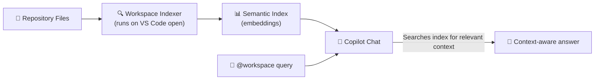
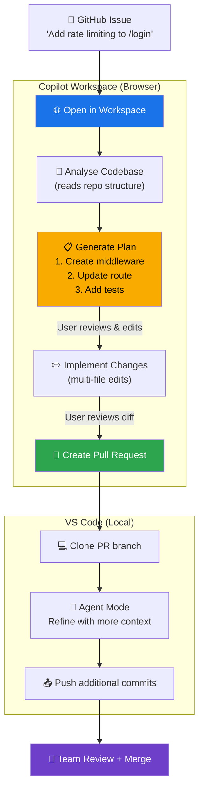

# Copilot Workspace & VS Code Integration

Copilot Workspace is a cloud-based development environment that takes you from a task description to a pull request — without leaving your browser. This module also covers how Copilot integrates across different editors and GitHub.com itself.

---

## Table of Contents

- [What is Copilot Workspace?](#what-is-copilot-workspace)
- [Copilot Workspace Flow](#copilot-workspace-flow)
- [VS Code Copilot Features](#vs-code-copilot-features)
- [Multi-Editor Support](#multi-editor-support)
- [GitHub.com Copilot Features](#githubcom-copilot-features)
- [Managing Context with @workspace](#managing-context-with-workspace)
- [Workspace Flow Diagram](#workspace-flow-diagram)
- [Setup Instructions](#setup-instructions)
- [Mapping from Claude Plugins](#mapping-from-claude-plugins)

---

## What is Copilot Workspace?

Copilot Workspace is a **task-to-PR cloud environment** accessible at [githubnext.com/projects/copilot-workspace](https://githubnext.com/projects/copilot-workspace). It:

1. Starts from a GitHub issue (or blank task)
2. Uses Copilot to **analyse the codebase** and **create a plan**
3. Implements the plan across multiple files
4. Lets you review, edit, and iterate on the plan before committing
5. Creates a pull request when you're happy

Unlike VS Code agent mode (which runs locally), Workspace runs entirely in the browser with no local setup needed.

---

## Copilot Workspace Flow

### Starting from an Issue

```
# Method 1: From GitHub.com issue page
# Click the Copilot Workspace button (magic wand icon)

# Method 2: Directly from URL
https://copilot-workspace.githubnext.com/owner/repo/issues/42

# Method 3: From GitHub Codespaces
# Open Codespace → Terminal → copilot-workspace
```

### The Three-Panel Interface

```
┌─────────────────────────────────────────────────────────────────┐
│  TASK           │  PLAN              │  IMPLEMENTATION           │
│─────────────────│────────────────────│───────────────────────────│
│  Issue #42:     │  Steps:            │  src/auth/login.ts        │
│  Add rate       │  1. Add middleware │  + rateLimiter middleware │
│  limiting to    │  2. Update routes  │                           │
│  login endpoint │  3. Add tests      │  src/routes/auth.ts       │
│                 │  4. Update docs    │  + import rateLimiter     │
│  [Edit task]    │  [Edit plan]       │  [Review changes]         │
└─────────────────────────────────────────────────────────────────┘
```

### Iterating on the Plan

You can:
- Edit individual plan steps
- Add new steps
- Remove steps you want to handle manually
- Ask Copilot to regenerate the implementation for any step

---

## VS Code Copilot Features

### Inline Completions

The core Copilot experience — as you type, Copilot suggests code:

```typescript
// Type this:
function calculateTax(

// Copilot suggests:
function calculateTax(price: number, taxRate: number): number {
  return price * (1 + taxRate / 100);
}
// Press Tab to accept
```

**Tips:**
- `Tab` — Accept full suggestion
- `Alt+]` / `Alt+[` — Cycle through alternative suggestions
- `Ctrl+Right` — Accept word by word
- `Esc` — Dismiss suggestion

### Multi-File Edits (Edits Mode)

In VS Code Copilot Chat, switch to **Edits** mode to apply changes across multiple files simultaneously:

1. Open Chat panel → click **Edits** tab
2. Add files to the edit context with `+`
3. Describe your change
4. Copilot shows a diff for each file
5. Accept all with **Apply** or review file by file

### Inline Completions Settings

```json
// settings.json
{
  "github.copilot.enable": {
    "*": true,
    "plaintext": false,
    "markdown": true,
    "yaml": true
  },
  "github.copilot.editor.enableAutoCompletions": true,
  "editor.inlineSuggest.enabled": true,
  "editor.inlineSuggest.showToolbar": "onHover"
}
```

---

## Multi-Editor Support

Copilot is available beyond VS Code:

| Editor | Extension | Key Features |
|--------|-----------|-------------|
| **VS Code** | GitHub Copilot + Copilot Chat | Full feature set, agent mode |
| **JetBrains** (IntelliJ, PyCharm, etc.) | GitHub Copilot | Completions + chat (no agent mode) |
| **Neovim** | `github/copilot.vim` | Completions, no chat |
| **Visual Studio** | GitHub Copilot | Completions + chat |
| **Xcode** | GitHub Copilot for Xcode | Completions + chat |
| **Eclipse** | GitHub Copilot | Completions |

### JetBrains Setup

```bash
# 1. Open JetBrains IDE
# 2. Settings → Plugins → Marketplace
# 3. Search "GitHub Copilot" → Install
# 4. Tools → GitHub Copilot → Login to GitHub
# 5. Copilot icon appears in the status bar
```

### Neovim Setup

```lua
-- Using lazy.nvim
{
  "github/copilot.vim",
  config = function()
    vim.g.copilot_no_tab_map = true
    vim.api.nvim_set_keymap("i", "<C-J>", 'copilot#Accept("<CR>")', {
      expr = true,
      silent = true
    })
  end,
}
```

---

## GitHub.com Copilot Features

### Immersive Mode (github.com)

Press `.` on any repository to open the lightweight github.dev editor with Copilot. This is useful for quick edits without a local setup.

### Copilot on Issues and PRs

- **Issues** — Ask Copilot questions about the codebase from within an issue
- **PRs** — Generate descriptions, request reviews, ask about specific changes

```
# In a PR comment, mention @github-copilot to ask questions:
@github-copilot explain what this change to the payment module does
@github-copilot does this change have any security implications?
```

### Copilot Search (github.com)

In the GitHub.com search bar, AI-powered results help find relevant code across the repository.

---

## Managing Context with @workspace

The `@workspace` participant in Copilot Chat gives the model access to your entire repository structure. It builds an index of your files for semantic search.

### How @workspace Indexes Your Project



### Maximising @workspace Effectiveness

```
# Bad: Vague reference
@workspace how does auth work?

# Good: Specific question
@workspace explain the authentication flow starting from POST /api/login, 
including how the JWT is generated and how middleware validates it on 
subsequent requests

# Reference specific files
@workspace #src/middleware/auth.ts how does this middleware handle token expiry?
```

### @workspace + .github/copilot-instructions.md

Your `copilot-instructions.md` is automatically included in every `@workspace` query, giving Copilot context about your project conventions even for general questions.

---

## Workspace Flow Diagram



---

## Setup Instructions

### VS Code (Primary Setup)

```bash
# 1. Install VS Code
# https://code.visualstudio.com

# 2. Install Copilot extensions
code --install-extension GitHub.copilot
code --install-extension GitHub.copilot-chat

# 3. Sign in to GitHub
# VS Code → Accounts icon → Sign in with GitHub

# 4. Verify Copilot is active
# Bottom status bar shows GitHub Copilot icon (not crossed out)

# 5. Test it
# Open any code file, start typing, see suggestions appear
```

### Enable Copilot Workspace

```bash
# Copilot Workspace is in preview — request access at:
# https://githubnext.com/projects/copilot-workspace

# Once approved, access from any issue:
# github.com/<owner>/<repo>/issues/<number>
# Click the "Open in Copilot Workspace" button
```

---

## Mapping from Claude Plugins

Claude Plugins bundle skills, hooks, and commands into an installable package. Copilot achieves the same through different mechanisms:

| Claude Plugin Component | Copilot Equivalent |
|------------------------|-------------------|
| Plugin manifest (YAML) | VS Code extension `package.json` |
| Bundled skills | Copilot Extension (GitHub App) |
| Bundled hooks | GitHub Actions workflows |
| Bundled slash commands | Custom instructions + prompt templates |
| `/install-github-app` | VS Code Marketplace install |
| `~/.claude/plugins/` storage | VS Code extension storage |
| Plugin for custom IDE | Copilot for VS Code/JetBrains/Neovim |
| Coding agent bootstrap | `copilot-setup-steps.yml` |

> **Key insight:** Claude Plugins are a single-file bundle concept. Copilot achieves the same composability through the ecosystem: Extensions for domain knowledge, Actions for automation, and instructions files for context.

---

## Next Module

[08 — Version Control & GitHub Integration →](../08-version-control/README.md)
