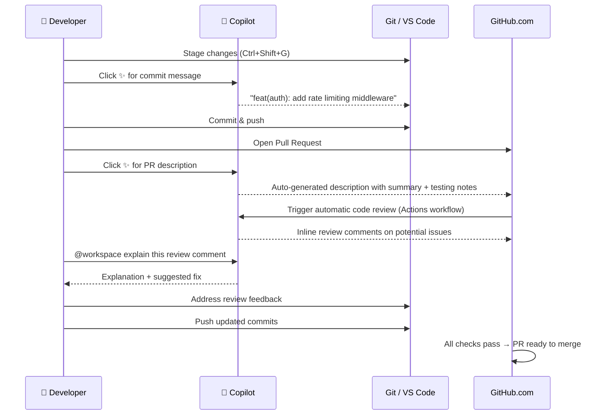

# Version Control & GitHub Integration

GitHub Copilot deeply integrates with Git and GitHub workflows — generating commit messages, summarising pull requests, reviewing code, and helping you understand change history. This module covers the full version control lifecycle with Copilot.

---

## Table of Contents

- [Copilot-Generated Commit Messages](#copilot-generated-commit-messages)
- [Pull Request Descriptions](#pull-request-descriptions)
- [Copilot Code Review](#copilot-code-review)
- [Using Chat for Code Review Discussions](#using-chat-for-code-review-discussions)
- [Git Workflow Best Practices](#git-workflow-best-practices)
- [PR Workflow Diagram](#pr-workflow-diagram)
- [Prompt Patterns for Code Review](#prompt-patterns-for-code-review)
- [Mapping from Claude Checkpoints](#mapping-from-claude-checkpoints)

---

## Copilot-Generated Commit Messages

### VS Code Source Control Panel

1. Open **Source Control** panel (`Ctrl+Shift+G`)
2. Stage your changes
3. Click the **sparkle icon** (✨) next to the commit message box
4. Copilot analyses the diff and suggests a message
5. Edit if needed → commit

### What Copilot Generates

Given a diff that adds a password validation function, Copilot might generate:

```
feat(auth): add password strength validation

Add validatePasswordStrength() utility that enforces:
- Minimum 8 characters
- At least one uppercase letter
- At least one number
- At least one special character

Returns a ValidationResult with isValid flag and array of
failure reasons for user feedback.
```

### Conventional Commit Format

To train Copilot to use conventional commits, add to `.github/copilot-instructions.md`:

```markdown
## Git Conventions
Commit messages must follow Conventional Commits format:
- feat: new feature
- fix: bug fix
- docs: documentation only
- refactor: code change that neither fixes a bug nor adds a feature
- test: adding or updating tests
- chore: build, tooling, dependency updates

Format: <type>(<scope>): <short description>

Include a body if the change needs explanation.
```

### Terminal-Based Commit Message Generation

```bash
# Generate a commit message from the staged diff
git diff --staged | gh copilot suggest "write a conventional commit message for this diff"

# Or use the alias
git diff --staged | ghcs "write a commit message"
```

---

## Pull Request Descriptions

### Auto-Generate on GitHub.com

When creating a PR on GitHub.com:

1. Click **Create Pull Request**
2. In the description field, click the **Copilot icon** (✨)
3. Copilot reads the commits and diff, then generates a description
4. Edit and publish

### Generated PR Description Structure

Copilot typically produces:

```markdown
## Summary
Brief description of what changed and why.

## Changes
- Add `validatePasswordStrength()` in `src/utils/password.ts`
- Integrate validation in `src/routes/auth.ts` (POST /register)
- Add 12 unit tests in `src/utils/password.test.ts`

## Testing
Unit tests cover:
- Valid passwords (happy path)
- Each validation rule in isolation
- Multiple simultaneous failures

## Notes
This validates on the server side only. Client-side validation
(React form) is tracked in #89.
```

### From the CLI

```bash
# Generate PR description from the current branch
gh pr create --title "feat(auth): add password validation" \
  --body "$(git log main..HEAD --oneline | gh copilot suggest 'write a PR description for these commits')"
```

---

## Copilot Code Review

### Enabling Automatic Review

```yaml
# .github/workflows/copilot-review.yml
name: Copilot Code Review

on:
  pull_request:
    types: [opened, synchronize]
    paths:
      - 'src/**'
      - '!src/**/*.test.ts'

permissions:
  pull-requests: write
  contents: read

jobs:
  review:
    runs-on: ubuntu-latest
    steps:
      - uses: actions/checkout@v4
        with:
          fetch-depth: 0

      - name: Copilot Code Review
        uses: github/copilot-code-review@v1
        with:
          github-token: ${{ secrets.GITHUB_TOKEN }}
          review-instructions: |
            Focus on:
            - Security vulnerabilities (SQL injection, XSS, auth issues)
            - Missing error handling
            - Performance problems (N+1 queries, missing indexes)
            - Violations of our TypeScript strict mode conventions
```

### What Copilot Reviews

Copilot code review leaves inline comments on:

- **Security issues** — unvalidated inputs, SQL injection vectors, exposed credentials
- **Logic bugs** — off-by-one errors, null dereferences, race conditions
- **Performance** — inefficient algorithms, missing caching, N+1 patterns
- **Maintainability** — complex functions, poor naming, missing tests

### Customising Review Focus

Add to your copilot instructions or the workflow:

```yaml
review-instructions: |
  This is a financial application. Pay extra attention to:
  - Decimal precision in monetary calculations (use Decimal.js, not floats)
  - Audit logging (all financial transactions must be logged)
  - Authorization checks (users can only see their own transactions)
  - Input validation on all amount fields
```

---

## Using Chat for Code Review Discussions

### Review Someone Else's PR

```bash
# Check out the PR branch locally
gh pr checkout 42

# Then in Copilot Chat:
@workspace /explain the changes in this branch compared to main

@workspace are there any security concerns with this pull request?

@workspace does this change follow our coding conventions in .github/copilot-instructions.md?
```

### Understand a Diff

```
# Select a diff block in the editor, then:
/explain what problem is this change solving?

# Or in chat:
@workspace #src/payment/processor.ts explain why the retry logic was changed in the last commit
```

### Suggest Alternative Implementations

```
@workspace the change in src/cache/redis.ts looks correct but I think there's a simpler approach.
Can you suggest an alternative that achieves the same result with fewer lines?
```

---

## Git Workflow Best Practices

### Commit Frequently (Checkpoint Strategy)

Small, frequent commits create natural checkpoints you can revert to — the Git equivalent of Claude's checkpoint feature:

```bash
# ✅ Good commit hygiene (each commit = one logical change)
git add src/auth/validate.ts
git commit -m "feat(auth): add email format validation"

git add src/auth/validate.ts src/auth/validate.test.ts
git commit -m "test(auth): add unit tests for email validation"

# ❌ Avoid large unfocused commits
git add .
git commit -m "fixed stuff"
```

### Using Copilot as a Git Assistant

```
# In terminal, Ctrl+I to open Copilot:
how do I undo my last commit but keep the changes staged?

how do I find which commit introduced a specific bug using git bisect?

how do I squash the last 3 commits into one?

what is the command to see all files changed in a specific commit?
```

### Branch Strategy with Copilot

```bash
# Create a feature branch for each Copilot-assisted task
git checkout -b feat/copilot-add-rate-limiting

# Work with Copilot agent mode
# ... agent makes multiple commits ...

# Before opening PR, clean up history
git rebase -i main   # squash work-in-progress commits

# Push and open PR
gh pr create --fill    # --fill uses last commit message as title
```

---

## PR Workflow Diagram



---

## Prompt Patterns for Code Review

### Security Review

```
@workspace review this pull request branch for security vulnerabilities.
Focus on: authentication bypass, injection attacks, insecure direct object references, missing authorization checks.
For each issue, explain: what the vulnerability is, how it could be exploited, and how to fix it.
```

### Performance Review

```
@workspace analyse the database queries in this PR for N+1 problems, missing indexes, and inefficient joins.
Show the problematic code and suggest optimised alternatives with estimated query plan improvements.
```

### API Contract Review

```
@workspace does this PR maintain backward compatibility with the existing API?
Check for: removed endpoints, changed response schemas, new required parameters, changed status codes.
```

### Test Coverage Review

```
@workspace what test cases are missing from the tests added in this PR?
The tests should cover: happy path, all error conditions, boundary values, and concurrent access.
```

---

## Mapping from Claude Checkpoints

| Claude Checkpoint | Git + Copilot Equivalent |
|-------------------|--------------------------|
| Create checkpoint | `git commit` |
| List checkpoints | `git log --oneline` |
| Restore checkpoint | `git checkout <sha>` or `git revert <sha>` |
| Compare checkpoints | `git diff <sha1> <sha2>` |
| Describe checkpoint | Copilot-generated commit message |
| Share checkpoint | Push branch + open PR |
| Review all changes | PR diff on GitHub.com + Copilot review |
| Annotate checkpoint | PR description (Copilot-generated) |
| Discard changes | `git stash` or `git checkout -- .` |

### The Copilot Checkpoint Workflow

```bash
# Start a task
git checkout -b task/add-user-preferences

# Work with Copilot, commit often
git add -p && git commit    # ← Copilot generates commit message
git add -p && git commit
git add -p && git commit

# View your "checkpoints"
git log --oneline main..HEAD

# Revert to a prior checkpoint
git reset --hard <commit-sha>

# When done, open a PR (Copilot generates the description)
gh pr create
```

---

## Next Module

[09 — Advanced GitHub Copilot Features →](../09-advanced-features/README.md)
