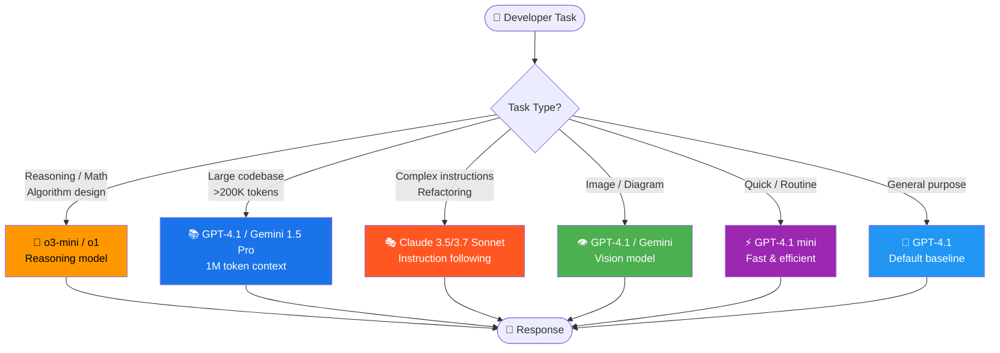

# Advanced GitHub Copilot Features

Beyond the basics, Copilot offers powerful capabilities for complex tasks: multi-model selection, vision input, Copilot Workspace for large refactors, and deep GitHub.com integration. This module covers the features that separate beginner and advanced Copilot users.

---

## Table of Contents

- [Multi-Model Selection](#multi-model-selection)
- [Model Comparison & Selection Guide](#model-comparison--selection-guide)
- [Multi-Model Routing Diagram](#multi-model-routing-diagram)
- [Vision Capabilities](#vision-capabilities)
- [Referencing Context in Chat](#referencing-context-in-chat)
- [Copilot Workspace for Large Refactors](#copilot-workspace-for-large-refactors)
- [Copilot in GitHub.com Immersive Mode](#copilot-in-githubcom-immersive-mode)
- [Notebook Support](#notebook-support)
- [Mapping from Claude Advanced Features](#mapping-from-claude-advanced-features)

---

## Multi-Model Selection

GitHub Copilot supports multiple AI models from different providers. You can switch models per-conversation based on the task at hand.

### How to Change Models

1. Open Copilot Chat (`Ctrl+Shift+I`)
2. Click the **model selector** in the chat toolbar (shows current model name)
3. Select from the available models
4. Your selection persists for the current conversation

### Available Models (2025)

| Model | Provider | Context Window | Best For |
|-------|----------|---------------|----------|
| **GPT-4.1** | OpenAI | 1M tokens | Complex reasoning, long codebases, architecture decisions |
| **GPT-4.1 mini** | OpenAI | 1M tokens | Fast responses, simple tasks, cost-efficient |
| **Claude 3.5 Sonnet** | Anthropic | 200K tokens | Code generation, refactoring, following complex instructions |
| **Claude 3.7 Sonnet** | Anthropic | 200K tokens | Extended reasoning, complex debugging |
| **Gemini 1.5 Pro** | Google | 1M tokens | Multimodal tasks, very large codebase analysis |
| **Gemini 2.0 Flash** | Google | 1M tokens | Fast, efficient, good for routine tasks |
| **o3-mini** | OpenAI | 200K tokens | Mathematical reasoning, algorithm design, optimisation |
| **o1** | OpenAI | 200K tokens | Step-by-step reasoning, formal verification |

---

## Model Comparison & Selection Guide

### Decision Framework

```
What type of task is it?
│
├── Needs multi-step reasoning / math / algorithms?
│   └── Use o3-mini or o1
│
├── Large codebase — need to load many files?
│   └── Use GPT-4.1 or Gemini 1.5 Pro (large context windows)
│
├── Complex refactoring with many constraints?
│   └── Use Claude 3.5/3.7 Sonnet (excels at following detailed instructions)
│
├── Image or diagram analysis?
│   └── Use GPT-4.1 or Gemini 1.5/2.0
│
├── Quick question, simple completion?
│   └── Use GPT-4.1 mini or Gemini 2.0 Flash (faster, efficient)
│
└── Default / uncertain?
    └── Start with GPT-4.1 — best general-purpose baseline
```

### Model Strengths Table

| Task | Best Model | Why |
|------|-----------|-----|
| Generate boilerplate code | GPT-4.1 mini | Fast, accurate for routine patterns |
| Debug complex race condition | Claude 3.7 Sonnet | Strong sequential reasoning |
| Analyse entire codebase architecture | GPT-4.1 / Gemini 1.5 Pro | Largest context window |
| Optimise an algorithm | o3-mini | Mathematical reasoning mode |
| Explain a diagram/screenshot | GPT-4.1 / Gemini | Multimodal vision |
| Refactor with 20 constraints | Claude 3.5 Sonnet | Excellent instruction following |
| Write security-sensitive code | Claude 3.5 Sonnet | Conservative, thorough |
| Generate test data | GPT-4.1 mini | Fast, cost-efficient |

---

## Multi-Model Routing Diagram



---

## Vision Capabilities

Copilot Chat supports image attachments. You can pass screenshots, diagrams, mockups, or error screenshots to provide visual context.

### How to Attach Images

```
# In VS Code Chat panel:
1. Click the paperclip icon (📎) in the chat input
2. Select an image file (PNG, JPEG, GIF, WebP)
3. Type your question and send

# Or drag and drop an image into the chat input
```

### Use Cases

#### Describe a UI Mockup

```
[Attach: mockup.png]
Generate the React component for this UI mockup using Tailwind CSS.
The component should be fully accessible (ARIA labels, keyboard navigation).
```

#### Reproduce a Bug from a Screenshot

```
[Attach: error-screenshot.png]
This error appears in our production logs. Based on this stack trace screenshot,
where in our codebase is this error likely originating?
```

#### Document an Architecture Diagram

```
[Attach: architecture.png]
Generate an ADR (Architecture Decision Record) documenting the system shown
in this diagram. Include: context, decision, consequences, and alternatives considered.
```

#### Reverse-Engineer a UI

```
[Attach: competitor-ui.png]
What CSS and HTML structure would produce this layout? 
Use CSS Grid for the overall layout and Flexbox for the cards.
```

---

## Referencing Context in Chat

### File References (`#filename`)

```
# Reference a specific file
@workspace #src/auth/middleware.ts explain the token validation logic

# Reference multiple files
@workspace compare the error handling in #src/api/users.ts and #src/api/products.ts

# Reference a symbol within a file
@workspace #src/utils/validators.ts#validateEmail explain what edge cases this covers
```

### Selection Context

Select code in the editor, then open inline chat (`Ctrl+I`) — the selection is automatically included as context.

### Web URL References

In Copilot Chat (with web access enabled):

```
Explain the breaking changes in this migration guide and tell me which ones affect our codebase: https://nextjs.org/docs/upgrading/version-15

Based on this RFC https://github.com/tc39/proposal-temporal, which date/time operations in our codebase should be migrated?
```

---

## Copilot Workspace for Large Refactors

Copilot Workspace excels at large-scale changes that touch many files — something impractical with single-session chat.

### Example: Migrate from REST to GraphQL

```
Task description in Copilot Workspace:
"Migrate our Express REST API to GraphQL using Apollo Server.

Current state:
- REST API with 12 endpoints in src/routes/
- Express + TypeScript

Target state:
- Apollo Server 4 with type-safe GraphQL schema
- Preserve all existing functionality
- Maintain backward compatibility via REST → GraphQL layer during transition
- Generate TypeScript types from schema using graphql-codegen

Do not touch: authentication middleware, database layer, or test utilities"
```

Workspace generates a plan with ~20 steps, you review each one, then it implements all of them.

### When to Use Workspace vs Agent Mode

| Scenario | Use |
|----------|-----|
| Task is well-scoped and < 10 files | VS Code Agent Mode |
| Task requires reviewing a plan before execution | Copilot Workspace |
| No local dev environment available | Copilot Workspace (browser-only) |
| Large-scale refactor touching 20+ files | Copilot Workspace |
| Task started from a GitHub issue | Copilot Workspace (direct integration) |
| Need to iterate rapidly with immediate feedback | VS Code Agent Mode |

---

## Copilot in GitHub.com Immersive Mode

Access GitHub Copilot directly on GitHub.com for repository-aware AI assistance:

### Accessing Immersive Mode

```
# Method 1: Keyboard shortcut
# On any GitHub.com page: press "." to open github.dev with Copilot

# Method 2: Via URL
https://github.com/owner/repo → https://github.dev/owner/repo

# Method 3: From an issue/PR
# Click "Open with Copilot" button (where available)
```

### Features Available on GitHub.com

- **Ask Copilot about issues** — "What is the root cause described in this issue?"
- **Ask about PRs** — "Summarise the security implications of this PR"
- **Search with AI** — Natural language search across the codebase
- **Repository understanding** — "What does this repository do and how is it structured?"

---

## Notebook Support

Copilot has first-class support for Jupyter notebooks in VS Code:

### Create a Notebook

```
# In Copilot Chat:
/newNotebook create a data analysis notebook for a CSV dataset with:
- Load and inspect the data
- Descriptive statistics
- Visualisations: distribution plots, correlation heatmap
- Data cleaning (handle missing values and outliers)
- Export cleaned data
```

### Notebook-Specific Chat

In a Jupyter notebook file, Copilot understands cell context:

```python
# In a code cell, press Ctrl+I:
# "generate the next analysis step based on the dataframe shown above"
# Copilot reads prior cells for context
```

### Variable Inspector Integration

Copilot can reference variables from executed cells:

```
# After running a cell that creates `df`:
/explain what is the schema of the df variable and are there any data quality issues?
```

---

## Mapping from Claude Advanced Features

| Claude Advanced Feature | Copilot Equivalent |
|------------------------|-------------------|
| Extended thinking | o3-mini / o1 reasoning models |
| Background tasks | Copilot coding agent (async) |
| `/model <name>` | Model picker in chat UI |
| Image input | Attach image to chat |
| Web search | `@github` + web search (when enabled) |
| Large context sessions | GPT-4.1 / Gemini (1M token context) |
| Multiple parallel agents | Multiple coding agent issues |
| Session persistence | PR history + git log |
| Custom model parameters | Not directly exposed (handled by model selection) |
| `--verbose` thinking output | Not exposed (reasoning is internal to o3/o1) |

> **Key difference:** Claude exposes thinking steps explicitly (`--think`). Copilot's reasoning models (o3-mini, o1) reason internally but don't show their work. For transparent step-by-step reasoning, use structured prompts that ask Copilot to "think step by step" in its response.

---

## Next Module

[10 — GitHub Copilot CLI Reference →](../10-cli/README.md)
