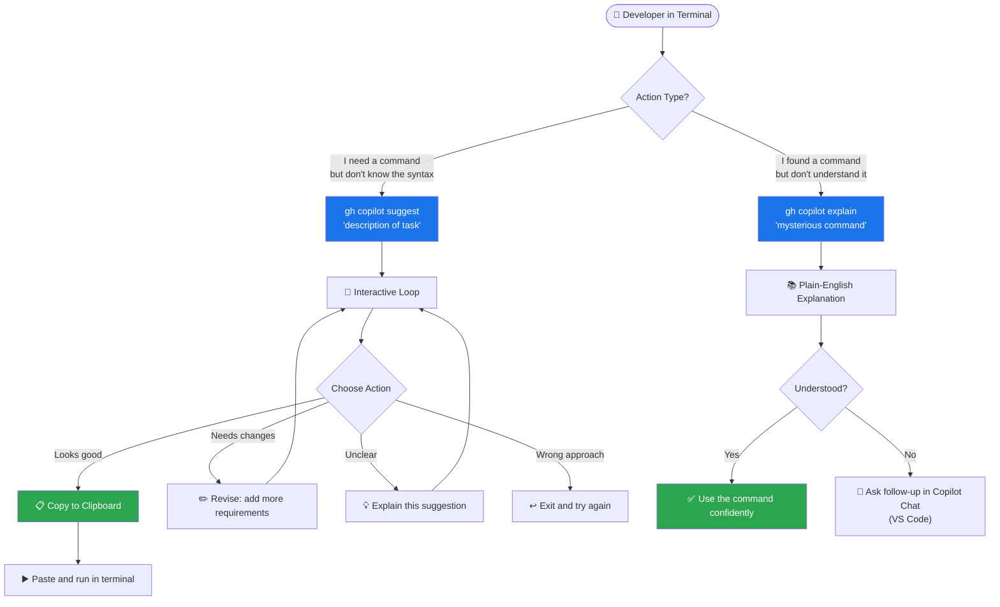

# GitHub Copilot CLI Reference

The `gh copilot` extension brings GitHub Copilot assistance directly to your terminal. Unlike the full `claude` CLI (which is a coding environment), `gh copilot` is focused on one job: helping you understand and construct shell commands. This module covers everything you need to use it effectively.

---

## Table of Contents

- [Installation & Setup](#installation--setup)
- [gh copilot suggest](#gh-copilot-suggest)
- [gh copilot explain](#gh-copilot-explain)
- [The Interactive Revision Loop](#the-interactive-revision-loop)
- [Shell Aliases for Convenience](#shell-aliases-for-convenience)
- [Integration with Terminal Workflow](#integration-with-terminal-workflow)
- [CLI Interaction Flow Diagram](#cli-interaction-flow-diagram)
- [Copy-Paste Examples](#copy-paste-examples)
- [Comparison: Claude CLI vs gh copilot CLI](#comparison-claude-cli-vs-gh-copilot-cli)

---

## Installation & Setup

### Prerequisites

- [GitHub CLI (`gh`)](https://cli.github.com/) installed and authenticated
- GitHub Copilot subscription (Individual, Business, or Enterprise)

### Install the Extension

```bash
# Install the gh copilot extension
gh extension install github/gh-copilot

# Verify installation
gh copilot --version

# Update to latest version
gh extension upgrade gh-copilot
```

### Authenticate

```bash
# If not already authenticated with gh:
gh auth login

# Verify Copilot access
gh copilot suggest "hello world"
# If this prompts for a model or returns a suggestion, you're set
```

---

## gh copilot suggest

`gh copilot suggest` translates a plain-English description of what you want to do into a shell command.

### Basic Usage

```bash
gh copilot suggest "<description of what you want>"
```

### Examples

```bash
# Find files
gh copilot suggest "find all Python files modified in the last 7 days"

# Process text
gh copilot suggest "count the number of lines in all .log files in /var/log"

# Git operations
gh copilot suggest "show me all commits that touched the auth module in the last month"

# Docker operations
gh copilot suggest "list all containers using more than 500MB of memory"

# Network diagnostics
gh copilot suggest "show all processes listening on port 8080"

# File operations
gh copilot suggest "recursively find all files larger than 100MB and sort by size"

# Archive operations
gh copilot suggest "create a tar.gz of the src directory excluding node_modules and .git"
```

### Targeting a Shell

By default, `gh copilot suggest` generates commands for your current shell. Specify a different shell with `--shell-type`:

```bash
# Explicitly target bash
gh copilot suggest --shell-type bash "rename all .jpeg files to .jpg"

# Target PowerShell (useful on cross-platform teams)
gh copilot suggest --shell-type powershell "find files modified today"

# Target fish
gh copilot suggest --shell-type fish "set environment variable for this session"

# Target zsh
gh copilot suggest --shell-type zsh "reload shell configuration"
```

---

## gh copilot explain

`gh copilot explain` takes a shell command and returns a plain-English explanation of what it does.

### Basic Usage

```bash
gh copilot explain "<command to explain>"
```

### Examples

```bash
# Explain a complex pipeline
gh copilot explain "awk 'NR==FNR{a[$1];next} $1 in a' file1.txt file2.txt"

# Explain sed
gh copilot explain "sed -i 's/\bfoo\b/bar/gI' *.txt"

# Explain find
gh copilot explain "find . -name '*.pyc' -not -path './.git/*' -delete"

# Explain a git command
gh copilot explain "git log --all --oneline --graph --decorate"

# Explain networking
gh copilot explain "ss -tlnp | grep LISTEN"

# Explain curl
gh copilot explain "curl -X POST -H 'Content-Type: application/json' -d @payload.json https://api.example.com/data"
```

### Explaining Commands from History

```bash
# Explain the last command you ran
gh copilot explain "$(history | tail -1 | sed 's/[0-9]* //')"

# Explain a command from a script you're reading
cat deploy.sh | head -20 | gh copilot explain "$(cat)"
```

---

## The Interactive Revision Loop

When `gh copilot suggest` returns a command, you enter an interactive loop:

```
$ gh copilot suggest "compress all PNG files in the current directory"

Suggestion:

  find . -maxdepth 1 -name "*.png" -exec pngquant --force --output {} {} \;

? What would you like to do?
  ❯ Copy command to clipboard
    Explain command
    Revise command
    Rate response
    Exit
```

### Revision Examples

Select **Revise command** to iterate:

```
? Revise: also include subdirectories
→ find . -name "*.png" -exec pngquant --force --output {} {} \;

? Revise: only if file size is greater than 500KB
→ find . -name "*.png" -size +500k -exec pngquant --force --output {} {} \;

? Revise: run in parallel using xargs
→ find . -name "*.png" -size +500k | xargs -P 4 -I{} pngquant --force --output {} {}
```

---

## Shell Aliases for Convenience

Add these to your `.bashrc`, `.zshrc`, or `.config/fish/config.fish`:

### Bash / Zsh

```bash
# Add to ~/.bashrc or ~/.zshrc

# Short aliases
alias ghcs='gh copilot suggest'
alias ghce='gh copilot explain'

# With shell type pre-set
alias ghcsbash='gh copilot suggest --shell-type bash'

# Explain the last command
alias explain-last='gh copilot explain "$(history | tail -1 | sed '"'"'s/^[[:space:]]*[0-9]*[[:space:]]*//)'"'"'"'

# Suggest and immediately copy to clipboard (macOS)
ghcs-copy() { gh copilot suggest "$@" | grep -A1 "Suggestion:" | tail -1 | pbcopy; }

# Reload aliases
source ~/.bashrc  # or ~/.zshrc
```

### Fish Shell

```fish
# ~/.config/fish/config.fish

abbr --add ghcs 'gh copilot suggest'
abbr --add ghce 'gh copilot explain'

function explain-last
    gh copilot explain (history | head -1)
end
```

### PowerShell

```powershell
# Add to $PROFILE
function ghcs { gh copilot suggest @args }
function ghce { gh copilot explain @args }

Set-Alias -Name Suggest-Command -Value ghcs
Set-Alias -Name Explain-Command -Value ghce
```

---

## Integration with Terminal Workflow

### Workflow 1: Learn While Working

When you see a command you don't understand:

```bash
# You see this in a script:
find /proc -maxdepth 3 -name "cmdline" 2>/dev/null | xargs -I{} cat {} | tr '\0' ' '

# Explain it immediately:
ghce "find /proc -maxdepth 3 -name 'cmdline' 2>/dev/null | xargs -I{} cat {} | tr '\0' ' '"
```

### Workflow 2: Scripting Assistance

```bash
# Start with a high-level description, then iterate
ghcs "loop through all git repositories in ~/projects and pull latest changes"

# After reviewing, add error handling
ghcs "same but skip repos where the pull fails and log errors to ~/git-pull-errors.log"
```

### Workflow 3: Debugging Help

```bash
# When a command fails, ask for help
docker build . 2>&1 | tail -20 | ghce "$(cat)"
# → Copilot explains what the error means and suggests fixes
```

### Workflow 4: Script Generation

```bash
# Generate a complete shell script
ghcs "bash script that checks if required environment variables are set and exits with an error message if any are missing"

# Then copy and save to a file
# Edit as needed
```

---

## CLI Interaction Flow Diagram



---

## Copy-Paste Examples

### Daily Git Workflows

```bash
# Find commits by a specific author since last week
ghcs "git log commits by john@example.com since last Monday with stat"

# Clean up merged branches
ghcs "delete all local git branches that have been merged to main"

# Find large files in git history
ghcs "find the 10 largest files ever committed in this git repository"
```

### System Administration

```bash
# Monitor system resources
ghcs "show CPU and memory usage for the top 10 processes, updated every 2 seconds"

# Disk usage analysis
ghcs "find the 20 largest directories in /var, sorted by size, human readable"

# Log analysis
ghcs "count HTTP 500 errors per hour from nginx access log today"

# User management
ghcs "list all users who have logged in today with their last login time"
```

### Docker & Kubernetes

```bash
# Docker cleanup
ghcs "remove all stopped containers, unused images, and dangling volumes"

# Container inspection
ghcs "show environment variables for a running Docker container named my-app"

# Kubernetes
ghcs "get all pods in namespace production that are not in Running state"
ghcs "tail logs from all pods with label app=api-server"
```

### File Processing

```bash
# CSV operations
ghcs "extract columns 2 and 5 from a CSV file and save to a new file"

# Batch rename
ghcs "rename all files matching IMG_*.jpg to photo_NNNN.jpg with sequential numbering"

# Find duplicates
ghcs "find all duplicate files in the current directory by content hash"
```

---

## Comparison: Claude CLI vs gh copilot CLI

| Feature | Claude CLI (`claude`) | gh copilot (`gh copilot`) |
|---------|----------------------|--------------------------|
| **Primary purpose** | Full AI coding assistant | Shell command help |
| **Interactive session** | ✅ Full multi-turn session | ✅ Per-command interactive loop |
| **File editing** | ✅ Reads and writes files | ❌ Suggestions only |
| **Code generation** | ✅ Full programs | ❌ Shell commands only |
| **Explain code** | ✅ Any code | ⚠️ Shell commands only |
| **Shell type awareness** | ❌ Not shell-focused | ✅ `--shell-type` flag |
| **Copy to clipboard** | ❌ Manual | ✅ Built-in option |
| **Model selection** | ✅ via `/model` | ❌ Uses account default |
| **Context: files** | ✅ `/add-dir` | ❌ No file context |
| **Offline support** | ❌ Requires network | ❌ Requires network |
| **Platform** | macOS, Linux, Windows | macOS, Linux, Windows |
| **Install** | `npm i -g @anthropic-ai/claude-code` | `gh extension install github/gh-copilot` |

> **When to use which:** Use `gh copilot` for quick shell command help during normal terminal work. Use VS Code Copilot Chat (with `@workspace`) when you need the full codebase in context. Use the coding agent for autonomous multi-file tasks.

---

## Next Steps

You've completed the **GitHub Copilot in a Weekend** course! 🎉

- Run the **self-assessment quiz**: `../self-assessment.sh`
- Read the **transition guide**: `../TRANSITION_GUIDE.md`
- Return to any module for a deeper dive
- Explore the [original Claude How To modules](../../README.md) for comparison

| What's next | Link |
|-------------|------|
| Self-assessment quiz | [`../self-assessment.sh`](../../self-assessment.sh) |
| Transition guide | [`../TRANSITION_GUIDE.md`](../../TRANSITION_GUIDE.md) |
| Course landing page | [`../README.md`](../README.md) |
| Module 01 (start over) | [`../01-chat-commands/`](../01-chat-commands/README.md) |
